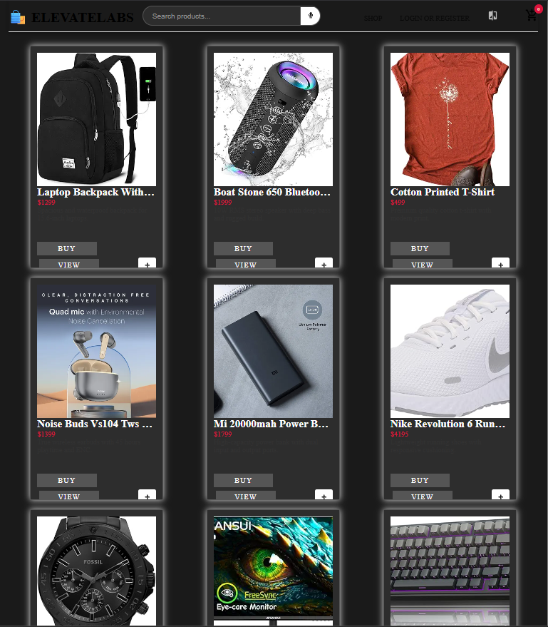
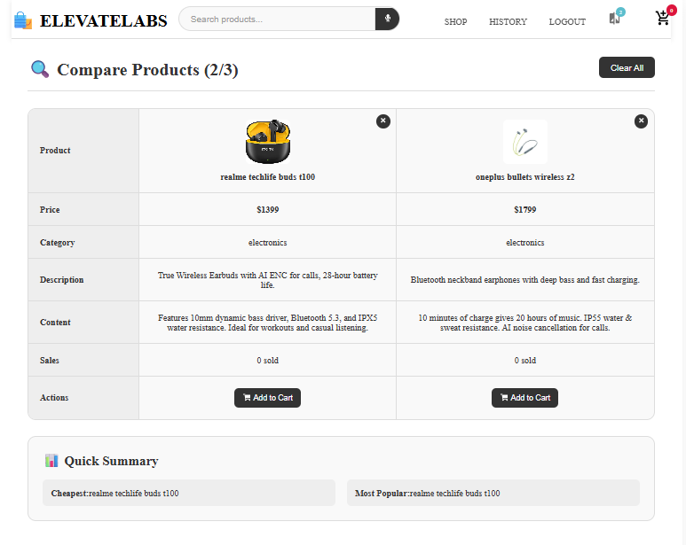

# ElevateLabs eCommerce Platform

## 🚀 Overview

ElevateLabs eCommerce is a comprehensive, feature-rich online shopping platform built using the MERN stack (MongoDB, Express, React, Node.js). The platform offers an intuitive user experience with advanced features like voice search, product comparison, real-time analytics, and robust admin controls. This project demonstrates modern full-stack development practices, focusing on performance, security, and user experience.

## ✨ Key Features

### 🛒 For Shoppers
- **Seamless Shopping Experience**: Intuitive product browsing, filtering, and cart management
- **Voice Search Capability**: Hands-free product searching using advanced speech recognition
- **Product Comparison**: Side-by-side comparison of multiple products to aid decision making
- **Smart Recommendations**: AI-powered product recommendations based on browsing history
- **Theme Toggle**: Light and dark mode support for better accessibility
- **Responsive Design**: Fully mobile-responsive interface for shopping on any device
- **Secure Checkout**: Protected payment processing and order management
- **Order History**: Complete history of previous purchases

### 🔧 For Administrators
- **Comprehensive Dashboard**: Overview of sales, inventory, and user activity
- **Real-time Analytics**: Visual data representations of business metrics
- **Product Management**: CRUD operations for products and categories
- **User Management**: Role-based access control and user administration
- **Order Tracking**: Real-time order status updates and management
- **Content Management**: Easy product information and image uploading

## � Screenshots

### Homepage

*Clean, modern homepage showcasing featured products with intuitive navigation*

### Dark Theme

*Elegant dark mode interface for better viewing experience in low-light conditions*

### Authentication

*Secure user authentication with clean login and registration forms*

### Shopping Cart

*Intuitive shopping cart interface with quantity controls and price calculations*

### Product Comparison

*Side-by-side product comparison feature helping users make informed decisions*

### Analytics Dashboard

*Comprehensive admin analytics dashboard with real-time data visualization*

## �🛠️ Technology Stack

### Frontend
- **React.js**: Frontend library for building user interfaces
- **React Router**: Navigation and routing management
- **Context API**: State management across the application
- **Axios**: HTTP client for API requests
- **CSS3**: Custom styling with modern CSS features
- **React Icons**: Comprehensive icon library
- **Web Speech API**: Voice recognition for search functionality
- **Recharts**: Data visualization for analytics dashboard

### Backend
- **Node.js**: JavaScript runtime environment
- **Express.js**: Web application framework
- **MongoDB**: NoSQL database for data storage
- **Mongoose**: MongoDB object modeling
- **JWT**: User authentication and authorization
- **Multer**: File uploading middleware
- **dotenv**: Environment variable management
- **bcrypt**: Password hashing for security

### DevOps & Tools
- **Git & GitHub**: Version control and code management
- **Postman**: API testing and documentation
- **VSCode**: Development environment
- **npm**: Package management

## 🎯 Project Outcomes & Skills Demonstrated

During the development of this project, I demonstrated several key competencies:

1. **Full-Stack Development**: Built a complete end-to-end solution using modern web technologies
2. **Problem-Solving**: Implemented complex features like voice search and product comparison
3. **UI/UX Design**: Created an intuitive, accessible, and responsive user interface
4. **API Development**: Designed and implemented RESTful APIs with proper error handling and validation
5. **Database Management**: Designed efficient data models and queries
6. **Authentication & Authorization**: Implemented secure user authentication flows
7. **Project Architecture**: Structured the codebase for maintainability and scalability
8. **Advanced React Patterns**: Used context API, hooks, and custom components effectively
9. **Performance Optimization**: Minimized load times and resource usage
10. **Debugging Skills**: Identified and resolved complex issues throughout development

## 📊 Architecture

The application follows a structured architecture with clear separation of concerns:

```
client/                 # Frontend React application
├── public/             # Static files
└── src/                
    ├── api/            # API integration services
    ├── components/     # UI components
    │   ├── admin/      # Admin-specific components
    │   ├── common/     # Shared components
    │   ├── comparison/ # Product comparison features
    │   ├── headers/    # Navigation components
    │   └── mainpages/  # Main page components
    ├── contexts/       # React context providers
    └── styles/         # CSS stylesheets

server/                 # Backend Node.js/Express application
├── controllers/        # Request handlers
├── middleware/         # Custom middleware functions
├── models/             # Mongoose data models
└── routes/             # API route definitions
```

## 🔐 Security Features

- JWT-based authentication
- Password hashing with bcrypt
- Role-based access control
- Protected API routes
- Secure HTTP headers
- Input validation and sanitization

## 📱 Responsive Design

The application is fully responsive and optimized for:
- Desktop browsers
- Tablets
- Mobile phones
- Various screen sizes and orientations

## 🚀 Getting Started

### Prerequisites
- Node.js (v14.x or higher)
- MongoDB (local or Atlas connection)
- npm or yarn package manager

### Installation

1. Clone the repository
```bash
git clone https://github.com/7Chethan007/ElevateLabs_eCommerce.git
cd ElevateLabs_eCommerce
```

2. Install server dependencies
```bash
cd server
npm install
```

3. Configure environment variables
```bash
# Create a .env file in the server directory with the following variables
MONGODB_URL=your_mongodb_connection_string
PORT=5000
ACCESS_TOKEN_SECRET=your_jwt_secret
REFRESH_TOKEN_SECRET=your_refresh_token_secret
CLOUD_NAME=your_cloudinary_name
CLOUD_API_KEY=your_cloudinary_api_key
CLOUD_API_SECRET=your_cloudinary_api_secret
```

4. Install client dependencies
```bash
cd ../client
npm install
```

5. Run development environment
```bash
# In the server directory
npm start

# In the client directory (in a new terminal)
npm start
```

6. Access the application
- Frontend: http://localhost:3000
- Backend API: http://localhost:5000

## 🧪 Testing

- Unit tests for critical components
- Integration tests for API endpoints
- E2E testing for critical user flows

```bash
# Run frontend tests
cd client
npm test

# Run backend tests
cd server
npm test
```

## 📋 Future Enhancements

- **Payment Gateway Integration**: Multiple payment options including credit cards, PayPal, etc.
- **Internationalization**: Multi-language support
- **Advanced Search**: Elasticsearch integration for better search capabilities
- **Social Media Integration**: Login and sharing via social platforms
- **Mobile App**: Native mobile applications using React Native
- **Performance Optimization**: Image optimization, code splitting, and lazy loading
- **Wishlist Feature**: Allow users to save products for later

## 👨‍💻 Development Practices

- **Code Quality**: ESLint and Prettier for code formatting
- **Version Control**: Feature-branch workflow with meaningful commit messages
- **Documentation**: Comprehensive code comments and API documentation
- **Performance**: Optimization for load times and responsiveness
- **Security**: Regular security audits and best practices implementation


## 📄 License

This project is licensed under the MIT License - see the [LICENSE](LICENSE) file for details.

## 🙏 Acknowledgments

- React.js community for excellent documentation and resources
- MongoDB for reliable data storage solutions
- Express.js for simplified server-side development
- Node.js for enabling JavaScript on the server
- All open-source contributors whose libraries made this project possible
- ElevateLabs for providing this valuable internship opportunity

---

Developed with ❤️ by Chethan | [GitHub](https://github.com/7Chethan007)
